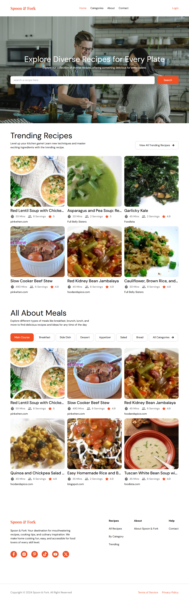
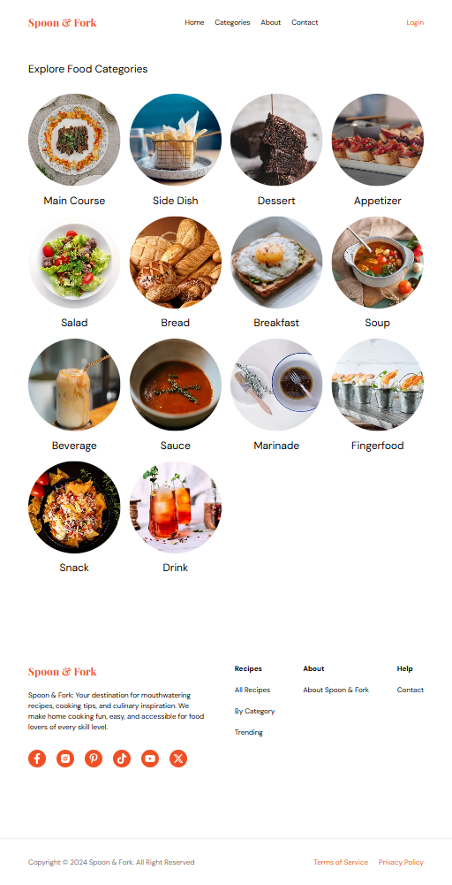
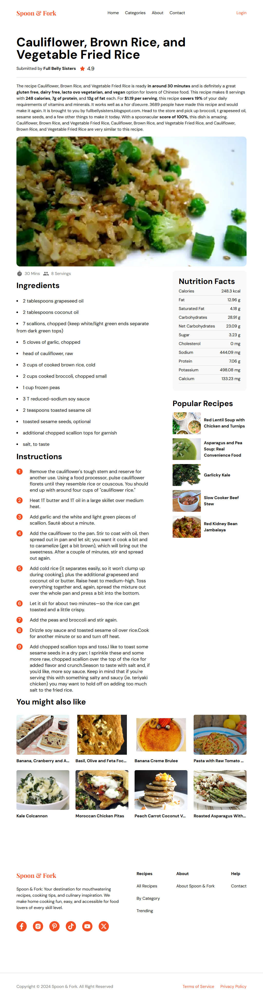

# 🍽️ Spoon & Fork

A beautifully designed **Recipe Finder** built with **Next,js**, **TypeScript**, and **Tailwind CSS**. This website helps users discover trending recipes, and explore detailed cooking instructions.

## 🌟 Features

✅ Browse **trending recipes**

✅ Search for recipes based on **keywords and categories** (more comming soon!)

✅ View **detailed recipe information**, including ingredients, cooking instructions, and nutrition facts.

✅ **View More** button for **infinite scrolling** (up to 100 recipes)

✅ **Responsive** design

## 🚀 Tech Stack

- **Frontend:** Next.js, TypeScript, Tailwind CSS
- **Data Fetching:** Spoonacular API
- **Version Control:** GitHub

## 📸 Screenshots

### Home Page



### Category Page



### Recipe Detail Page



## 🔧 Installation & Setup

1. **Clone the repository:**

   ```sh
   git clone https://github.com/malvz22/spoon-and-fork.git

   ```

2. **Install Dependencies:**

   ```sh
   npm install
   ```

   or

   ```sh
   yarn install
   ```

3. **Set up environment variables:**

   ```sh
   NEXT_PUBLIC_API_KEY=your_spoonacular_api_key
   ```

4. **Run the development server**

   ```sh
   npm run dev
   ```

   or

   ```sh
   yarn dev
   ```

5. **Open http://localhost:3000/ in your browser**

## 📌 Usage

1. Navigate through trending recipes

2. Click on a recipe to see details

3. Use the search bar to find recipes by keyword

4. Click "View More" to load additional recipes

5. Enjoy planning your meals! 🍽️

## 📝 API Reference

- **Spoonacular API**

  Base URL: `https://api.spoonacular.com`

  Example endpoint:

  ```sh
  GET /recipes/complexSearch?query=pasta&number=10&apiKey=YOUR_API_KEY
  ```

  Documentation Link: https://spoonacular.com/food-api/docs

## 🛠️ Future Improvements

- [ ] User Authentication (Sign up & Login)
- [ ] Save favorite recipes
- [ ] Advanced filtering (by nutrition, prep time, etc.)
- [ ] Meal planner calendar integration

## 🏆 Credits

- **Developed by:** [malvz22](https://github.com/malvz22)
- **API Used:** [Spoonacular API](https://spoonacular.com/)
